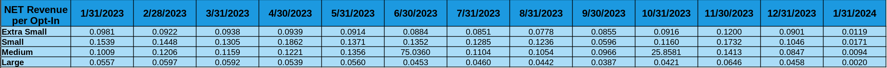
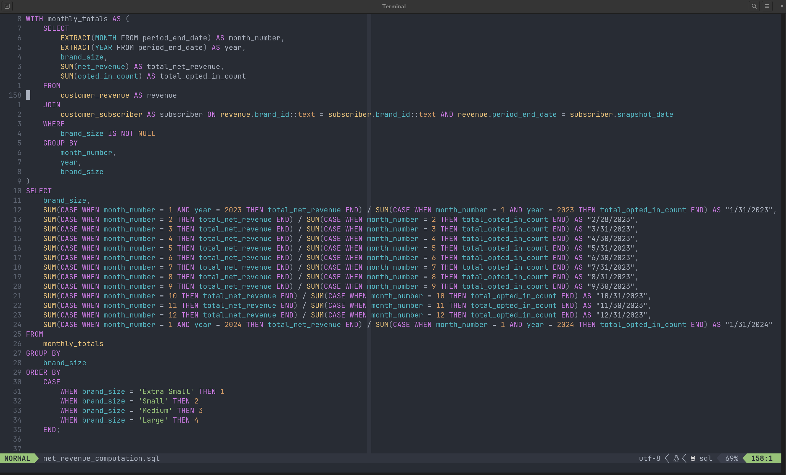

# PROJECT EXAM - Emotive
### Name: Derrick Adrian Payas
### Email: derykpayas@gmail.com
### Date: March 16, 2024

# Questions
## 1. Write an SQL script (or multiple scripts) to help answer the following: What is the Net Revenue per Opted In Count broken down by brand_size from Jan 2023 to Jan 2024? Populate the table below.



## 2. Please briefly outline the steps you took to answer the question (Include tools if any)

```
Steps for the extraction of Net Revenue per Opted In
a. Familiarize and explore datasets using Google Sheets. This includes
identification of potential errors and data cleaning.

b. Initial data cleaning using Neovim (text editor) and Nvim-R (R-Studio
extension for Neovim). Used tidyverse package to clean identified errors.

c. Automated migration of data to PostgreSQL using a Python script 

d. Coducted Exploratory Data Analysis (EDA) in SQL to identify potential errors
from the migration process.

e. Corrected errors that may potentially skew the results and updated existing 
tables in the database using SQL scripts.

f. Proceeded to data analysis using SQL script to extract Net Revenue per
Opted In Count broken down by brand size from each month.

g. Data Validation through another SQL script just to check if values are
matching and correct.
```

## 3. What data cleaning & correcting did you do, if any?

```
a. Dataset 1 (Customer Revenue)
    * brand_size
        replace 'Mediumm' to 'Medium'
        replace 'Smal' to 'Small'
    * brand_id
        replace 'National Foundation...' to '28671'
    * period_end_date
        converted data type to date

b. Dataset 2 (Customer Subscriber)
    * snapshot_date
        replace '2/29/2023' to '2/28/2023'
        converted data type to date
    * opted_in_count
        updated 0 values to (total_brand_subscriber - opted_out_count)
    * generalized naming convention of title headers for better coding
```

Check this link: [https://github.com/paadde/revenue_analysis](https://github.com/paadde/revenue_analysis) for the full data cleaning documentation. Documentations are
good practices for data transparency.

## 4. Please paste or attach the SQL you wrote



## 5. Given the SQL below, suggest improvements and highlight any issues you can identify:

```
a. Using Common Table Expression (CTE) might help in readability of the script

b. Use of capitalizations in SQL keywords, functions and clauses may also
improve readability of this SQL script.

c. Make the ALIASES more readable. Using meaningful and descriptive aliases
also improve readability and maintainability. It may be difficult for someone
to understand the query if Aliases are set to 'x', 'y', and 'b'. Suggested
ALIAS would be 'lines', 'invoices', and 'brands'.

d. Nested subquery in the LEFT JOIN clause can be improved for query
optimization.

LEFT JOIN emotive_brands AS brands ON invoices.customer_id = brands.stripe_id

e. While grouping columns in positional notation (GROUP BY 1, 2, 3, 4) may be
concise, it may pose readability issues and may be error-prone if columns were
moved or added.
```
